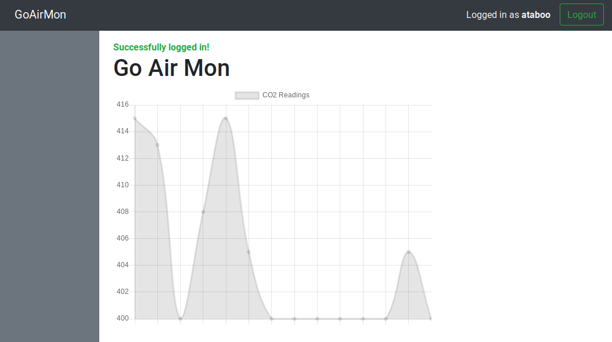

# goairmon

An CO2 monitor using a raspberry pi and the SGP-30 eCO2/TVOC sensor.

## Sensor Setup

- Enable I2C via `raspi-config`
- Run `sudo i2c-detect`, if you see 0x58 is available, the SGP-30 should be connected
- If the sensor is showing remote I/O errors, you can try slowing the baudrate via the boot config
- If the i2c address happens to be something other than 0x58, change the value in `/usr/local/goairmon/.env`

## Install

1. Unzip the arm6, arm7, or amd64 tar from the [dist directory](dist/) to a temporary folder on the pi.  
2. CD to the directory and run `cmd/adduser -username={username} -password={password}` to add a user.
3. You can change any values in the `.env` file and run the server via `./goairmon`.
3. Run `sudo ./install.sh` to copy everything to `/usr/local/goairmon` and install `goairmon.service`.
4. Confirm the service started with `sudo systemctl status goairmon`
5. Open `localhost:80` in the browser to view the web interface.

## Build From Source

1. Install go
2. Clone the project
3. cd to the root and run `make`
4. `dist` directory contains unzipped and tar balls. 

## Uninstall

Run `sudo /usr/local/goairmon/uninstall.sh`

## Adding/Removing Users

1. Before adding or removing users, stop the service `sudo systemctl stop goairmon`
2. cd to `/usr/local/goairmon`
3. Run `sudo cmd/adduser -username={username} -password={mypassword}` to add a user
4. Run `sudo cmd/rmuser -username={username}` to remove a user
5. Start the service again `sudo systemctl start goairmon`
